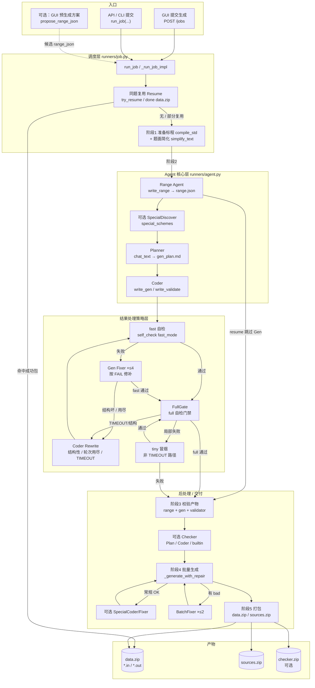
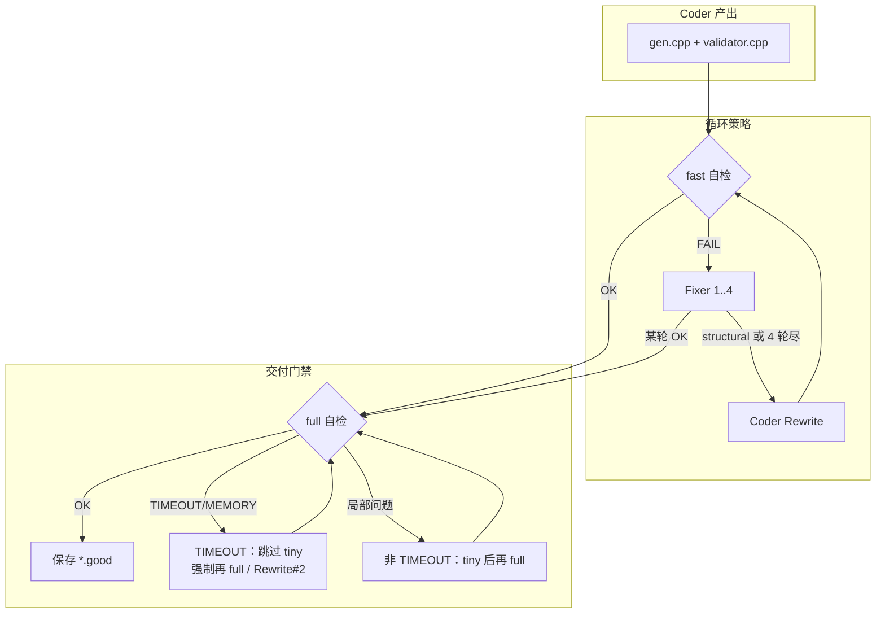
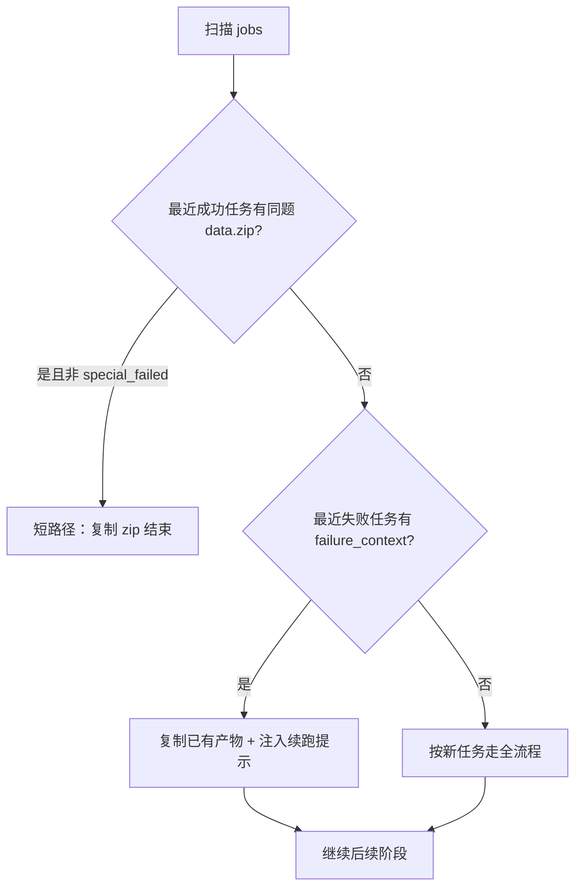
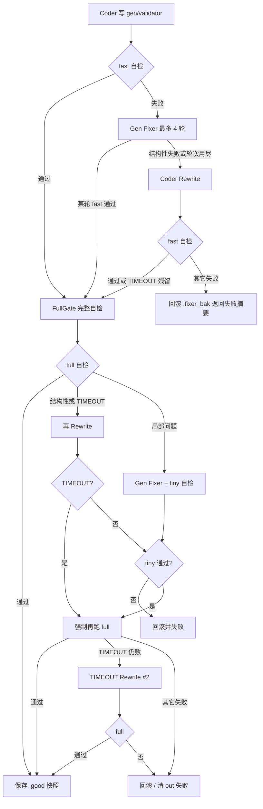

# 大模型调用流水线与结果处理策略

本文描述一次「提交生成」任务中，系统如何调用大模型、各 Agent 产出什么，以及成功 / 失败 / 超时后的分支策略。

入口：`runners/job.py` → `run_job` → `_run_job_impl`。编排逻辑以 `runners/` 为准。

在 Cursor / VS Code 中打开本文件即可预览下方 Mermaid 流程图（与分层架构图同风格：入口 → 调度 → 核心 Agent → 结果策略 → 产物）。

---

## 1. 总览流程图（分层）



### 箭头含义（策略标签）

| 标签 | 含义 |
| --- | --- |
| 命中成功包 | 复制 zip，**跳过**后续 LLM |
| 无 / 部分复用 | 继续全流程；失败上下文会注入 prompt |
| fast 通过 | 仅进入 FullGate，**不算**交付成功 |
| 失败 → Fixer | 局部修补，最多 4 轮 |
| 结构坏 / 用尽 / TIMEOUT | 整份 Rewrite；TIMEOUT 必须以 **full** 验收 |
| 有 bad → BatchFixer | 批跑失败后再修，最多约 2 轮 |
| Special 失败 | **非致命**，仍可打包常规测例 |

进度日志「阶段 1/5 … 5/5」：

| 日志阶段 | 对应上图 |
| --- | --- |
| 1/5 | 调度层 · 准备标程 |
| 2/5 | Agent 核心 + 结果处理策略 |
| 3/5 | 校验产物 |
| 3.5 | 可选 Checker |
| 4/5 | 批量生成 + 可选 Special |
| 5/5 | 打包 |

---

## 1.1 Gen 结果策略放大（Fixer / Rewrite / FullGate）



---

## 2. 谁在调大模型

| Agent / 步骤 | 调用方式 | 主要产物 | 代码位置 |
| --- | --- | --- | --- |
| 题面简化 | `chat_text` | `statement_simplified.txt` | `server/text_agent.py` |
| GUI 预生成方案 | `agent_run` / Range 提示 | 候选 `range.json` | `server/range_agent.py`（可选，提交前） |
| Range | `agent_run`（工具：`write_range`） | `range.json`、`problem_type` | `runners/agent.py` |
| SpecialDiscover | `chat_text` | `special_schemes` 写入 range | `server/special_discover.py` |
| Planner | `chat_text`（无工具） | `gen_plan.md` | `runners/agent.py` |
| Coder | `agent_run` | `gen.cpp`、`validator.cpp` | `runners/agent.py` |
| Gen Fixer | `agent_run` | 修补 gen / validator | `runners/agent.py` |
| Coder Rewrite | `agent_run` | 整份重写 gen / validator | `runners/agent.py` |
| Checker Planner | `chat_text` | `checker_plan.md` | `runners/review.py` |
| Checker Coder | `agent_run` | `checker.cpp` | `runners/review.py` |
| SpecialCoder | `agent_run` | `gen_special.cpp`、`check_special.cpp` | `runners/special.py` |
| SpecialFixer | `agent_run` | 修补 special | `runners/special.py` |
| BatchFixer | `agent_run` | 批跑失败后修 gen 或 special | `runners/review.py` |

不调 LLM 的关键步骤：标程编译、fast/full/tiny 自检、批量跑 gen→std、打包。

> 说明：`Reviewer` / 报告型 `Fixer` 的 prompt 构建函数仍在，但**当前 `run_job` 路径未接入**。

---

## 3. 同题复用（Resume）

提交后先做指纹匹配：题面 SHA256 + 标程 SHA256 + 语言。



| 结果 | 策略 |
| --- | --- |
| 命中完整成功包 | **短路径结束**，不再跑 Plan / Coder / 批跑 |
| 命中失败上下文 | 复用已有文件（如 `range.json`、`gen_plan.md`），把失败摘要注入后续 prompt |
| `resume_stage == checker` 且 gen/val 已在 | **跳过** Gen 阶段，直接进产物校验 → Checker |
| 无命中 | 全新执行 |

GUI 日志中的「最近 10 个成功任务」对应成功包扫描；失败上下文默认看最近约 3 个带 `failure_context.json` 的目录。

---

## 4. 各 Agent 结果处理策略

### 4.1 题面简化

| 结果 | 策略 |
| --- | --- |
| LLM 成功 | 写入 `statement_simplified.txt`，后续 Agent 用简化文 |
| 调用失败 | 回退本地 `to_plain_for_llm`，不阻断任务 |

### 4.2 Range Agent

工具循环：`write_range` → `finish`（`max_steps` 约 4）。

| 结果 | 策略 |
| --- | --- |
| 无已有方案 | 必须写出新 `range.json`，失败则任务中止 |
| 已有合法方案 | 可审核后复用，或重写 |
| 已有方案非法 | 强制重写 |
| 写出后校验失败 | `RuntimeError` 中止（有旧文件时可回退写回旧内容） |
| 核心签名未变（`reused`） | 可保留旧 `gen_plan.md`，跳过 Planner |
| 签名变化 / 新写 | 删除旧 plan，强制 Planner |

随后若开启特殊样例：走 **SpecialDiscover**（已有 schemes 且 range 复用则可跳过 LLM）。

### 4.3 Planner

| 结果 | 策略 |
| --- | --- |
| range 复用且已有 plan | **跳过** Planner |
| 一次写出完整 plan | 落盘 `gen_plan.md` |
| 结构不完整 | 再要一轮；仍差则再压 K 约束重试 |
| 过长（约大于 4000 字） | 压缩一轮 |
| 仍为空 / 异常 | 记日志；Coder 退化为完整长 task（不中止） |

### 4.4 Coder → Fixer → Rewrite → FullGate

这是最复杂的分支：自检分 **fast / tiny / full**；交付必须以 **full** 通过为准（尤其 TIMEOUT/MEMORY）。



| 结果类型 | 策略 |
| --- | --- |
| fast 通过 | 进入 FullGate，不直接当交付成功 |
| fast 失败 · 可修 | Gen Fixer（最多 4 轮）；每轮仍先看 fast |
| 结构性骨架问题（或 Fixer ≥2 轮仍结构坏 / 4 轮用尽） | **Coder Rewrite** 整份重写 |
| gen TIMEOUT | 优先查「唯一数 > 域基数」等；Rewrite 后 **禁止** 只靠 tiny/fast 收工 |
| std TIMEOUT / MEMORY | 先核解轴，再按标程方向调状态密度；验收必须 full |
| full 通过 | 保存 `*.good` 快照，进入产物校验 |
| full 仍失败 | 回滚备份；任务可带着失败摘要继续，但缺 gen/val 会在阶段 3 硬失败 |

触发 Rewrite 的判定见 `runners/agent.py` 中 `_needs_coder_rewrite`：Fixer 轮次用尽，或 `structural` 且已 Fixer ≥ 2 次。

### 4.5 Checker（可选，Special Judge）

| 结果 | 策略 |
| --- | --- |
| 未开 SPJ | 整段跳过 |
| 选用内置比较器 | 安装 builtin，**不跑** Checker Coder |
| Plan 要求 builtin | 同上 |
| Plan → Coder 写出 checker | 跑 checker 自检 |
| checker 自检失败 | **不中止任务**；打包时跳过 `checker.zip` |
| 无 checker 文件且必须自定义 | 可能 `RuntimeError` |

Checker **没有** 与 Gen 同级的多轮 Fixer 循环。

### 4.6 批量生成 + BatchFixer

| 结果 | 策略 |
| --- | --- |
| `out/` 已齐全 | 跳过批跑，直接打包 |
| 常规组有失败 | BatchFixer（最多约 2 轮）→ 再批跑；仍失败则中止打包 |
| 常规组成功 | 若有 special hook，先跑 Special，再补特殊测例 |
| 特殊批跑失败 | **非致命**：仍打包常规测例，并标记 `special_failed` |

### 4.7 SpecialCoder / SpecialFixer

每个 special scheme 顺序处理：

1. 写模板 plan（**0 次 LLM**）
2. SpecialCoder
3. 方案级检查（生成 → validate → 性质 → std 等）
4. 失败 → SpecialFixer（通常 1 次；`mutate` 失败可再强制 `build` 一轮）
5. 单方案失败 → 继续其它方案
6. 全部方案失败 → 上层按非致命处理（常规数据仍可打包）
7. 有方案成功 → 再跑 **full** 级 `special_only` 自检

---

## 5. 自检模式对照

| 模式 | 用途 | 能否算交付成功 |
| --- | --- | --- |
| `fast` | Agent 循环内快速结构 / 中档抽检 | 否（仅推进 Fixer/Rewrite） |
| `tiny` | Rewrite / 局部修复后的冒烟 | 否（TIMEOUT 路径常跳过） |
| `full` | 与批跑调度对齐的完整自检 | **是**（FullGate 门禁） |

Gen 阶段自检带 `skip_special=True`；特殊样例另用 `special_only`。

---

## 6. Prompt 组装位置

| 阶段 | System | Task |
| --- | --- | --- |
| Range | `agent.prompts.builders.build_range_prompt` | `runners/agent.py` 内联 |
| Planner | `build_planner_prompt` | `_build_planner_task`（可含压缩 few-shot） |
| Coder | `build_coder_prompt(problem_type)` | `_build_coder_task` |
| Gen Fixer | `build_gen_fixer_prompt` | `runners.prompts.build_gen_fixer_task` |
| Coder Rewrite | `build_coder_rewrite_prompt` | `build_coder_rewrite_task` |
| Checker | `build_checker_*` | `runners/review.py` |
| Special | `build_special_*` | `runners/special.py` |
| BatchFixer | gen 或 special fixer 提示 | `build_batch_fixer_task` |

题型模块按 `range.json.problem_type`（可多选）合并注入 Coder / Fixer 提示词。

---

## 7. 相关文件速查

- 任务总控：`runners/job.py`
- Gen 主路径：`runners/agent.py`（`run_gen_agent`、`_full_gate`、`_run_coder_rewrite`）
- 复用：`runners/resume.py`
- 批跑与修复：`runners/batch.py`、`runners/review.py`
- 特殊样例：`runners/special.py`、`server/special_discover.py`
- 提示词：`agent/prompts/`、`runners/prompts.py`
- 自检工具：`agent/tools/self_check.py`

---

## 8. 一句话记忆

```text
Resume 能抄则抄
  → Range 定方案
  → Plan 写策略
  → Coder 实现
  → 失败先 Fixer，骨架/超时再 Rewrite
  → 只有 full 自检通过才算交付
  → 可选 Checker / Special
  → 批跑失败再 BatchFixer
  → 打包（Special 挂了仍可交常规数据）
```
